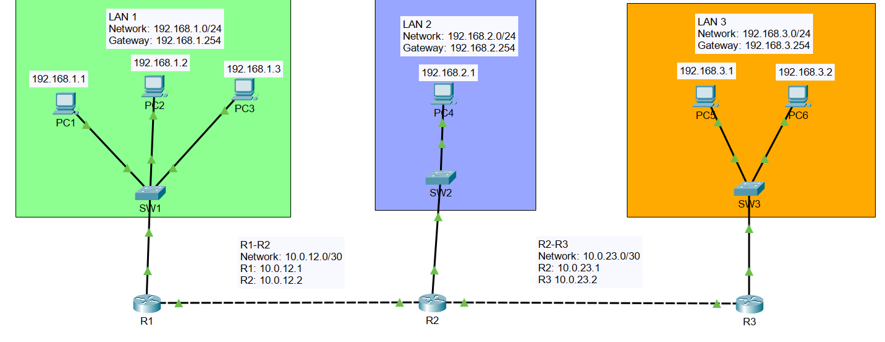

# 🌐 Static Routing Lab

A Cisco Packet Tracer lab demonstrating static routing between three routers and three LANs.

## 📷 Network Topology



---

## 🎯 Objective

Configure static routes to enable communication between all networks.

### Networks

| Network |          Gateway |
|----------|----------|
| 192.168.1.0/24 | 192.168.1.254 |
| 192.168.2.0/24 | 192.168.2.254 |
| 192.168.3.0/24 | 192.168.3.254 |

### WAN Links

| Link | Network |
|--------|---------|
| R1 ↔ R2 | 10.0.12.0/30 |
| R2 ↔ R3 | 10.0.23.0/30 |

---

## 🛠 Technologies Used

- Cisco Packet Tracer
- IPv4 Addressing
- Static Routing
- Router Configuration
- Network Troubleshooting

--
```
---

## ✅ Verification

show ip route
show ip interface brief
ping <destination-ip>
```
---

## 👨‍💻 Author

** ethicalkhawaja **
