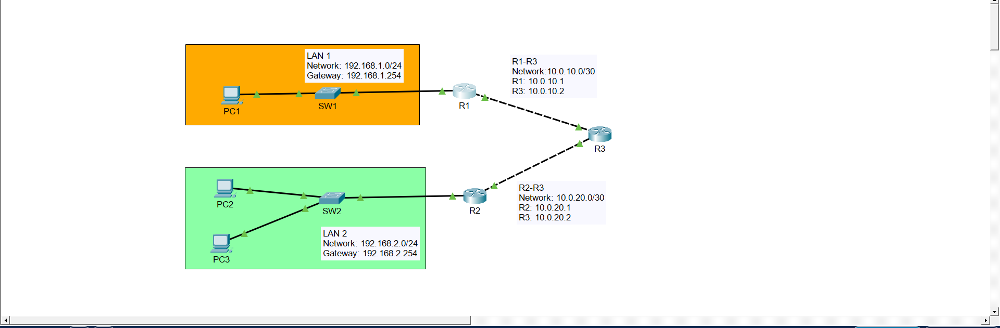

# 🛣️ OSPF Lab

A Cisco Packet Tracer lab demonstrating Single-Area OSPF routing.



## 🎯 Objective

Configure OSPF to dynamically exchange routing information and provide end-to-end connectivity between all networks.

## 🖧 Topology

- 3 Routers
- 2 LANs
- 2 WAN Links
- OSPF Area 0

## 🛠 Technologies

- Cisco Packet Tracer
- OSPFv2
- IPv4 Addressing
- Cisco IOS


## ✅ Commands Used

show ip ospf neighbor
show ip route
show ip protocols
show ip ospf interface brief
```

## 👨‍💻 Author

** ethicalkhawaja **