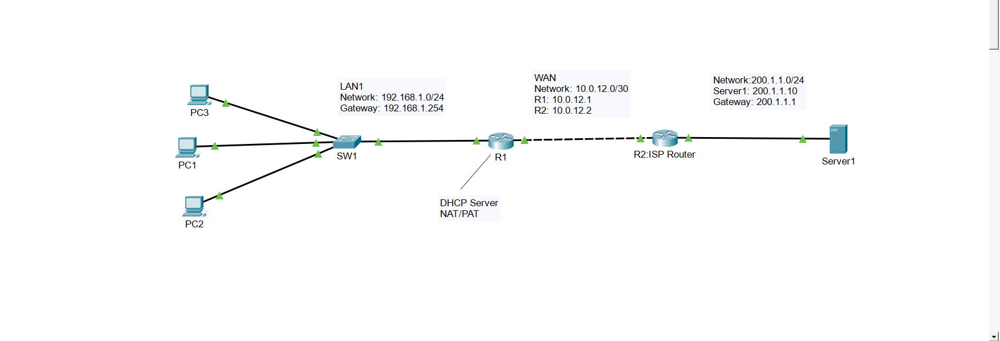
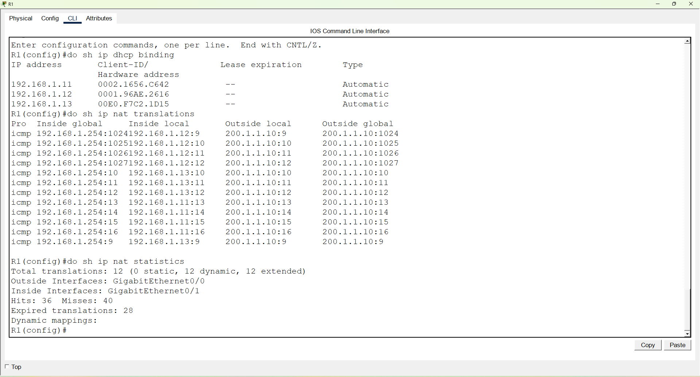
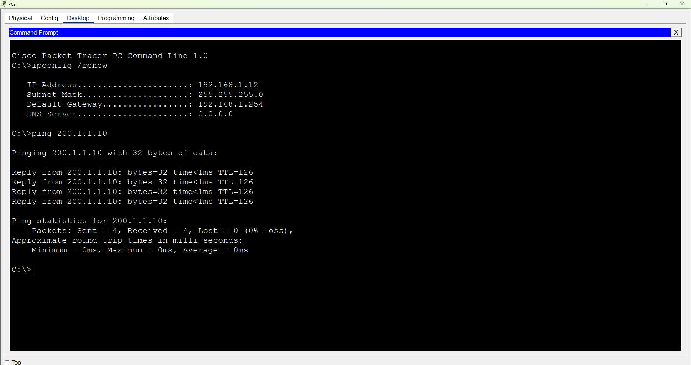

# 🌐 DHCP + NAT/PAT Lab

A Cisco Packet Tracer lab demonstrating DHCP and NAT/PAT configuration.



---

# 🎯 Objective

Configure DHCP to automatically assign IP addresses to clients and configure NAT/PAT to provide communication between private and external networks.

---

# 🖧 Network Information

## LAN Network
- 192.168.1.0/24

## WAN Network
- 10.0.12.0/30

## Server Network
- 200.1.1.0/24

---

# 🛠 Technologies Used

- Cisco Packet Tracer
- DHCP
- NAT/PAT
- Static Routing
- IPv4 Addressing
- Cisco IOS

---

# 📋 Device Roles

## R1
- DHCP Server
- NAT/PAT Router

## R2
- ISP Router

## Server
- External Host

## PC1
- DHCP Client

---

# 📸 Verification

## DHCP and NAT Verification



## Successful Ping Test



---

# ✅ Verification Commands

show ip dhcp binding
show ip nat translations
show ip nat statistics
```
---

# 👨‍💻 Author

** ethicalkhawaja **
