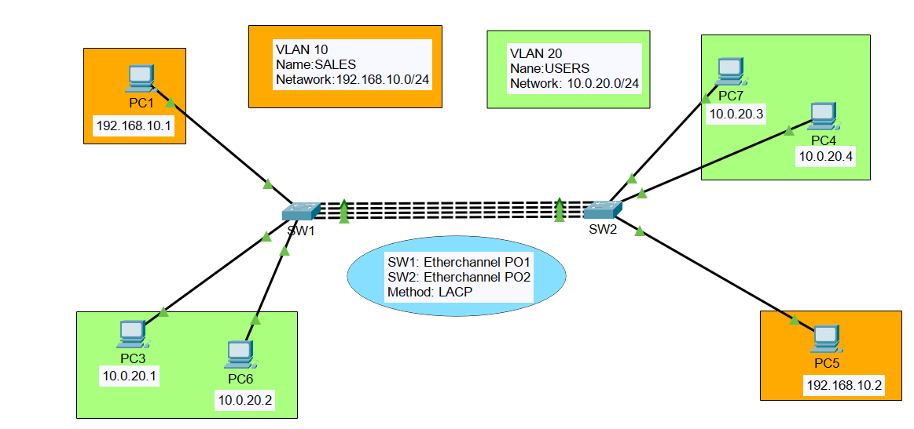

# 🔗 EtherChannel Configuration Using LACP



## 🎯 Objective

Configure EtherChannel using LACP between two Cisco switches and verify VLAN traffic across the Port-Channel trunk.

## 🛠 Technologies Used

- Cisco Packet Tracer
- VLANs
- Trunking
- EtherChannel
- LACP
- Layer 2 Switching

## 🌐 VLAN Information

| VLAN | Name | Network |
|------|------|----------|
| 10 | SALES | 192.168.10.0/24 |
| 20 | USERS | 10.0.20.0/24 |

## ⚙️ Configuration Summary

### SW1

```bash
interface range fa0/4 - 7
 channel-group 1 mode active

interface port-channel 1
 switchport mode trunk
 switchport trunk allowed vlan 10,20
```

### SW2

interface range fa0/3 - 6
 channel-group 2 mode active

interface port-channel 2
 switchport mode trunk
 switchport trunk allowed vlan 10,20

## ✅ Verification Commands

show vlan brief
show interfaces trunk
show etherchannel summary
```

## 📚 Skills Demonstrated

- VLAN Configuration
- Trunk Configuration
- EtherChannel Configuration
- LACP Configuration
- Layer 2 Switching
- Network Redundancy

## 👨‍💻 Author

ethical khawaja